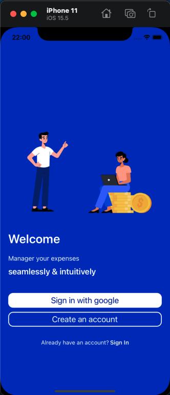
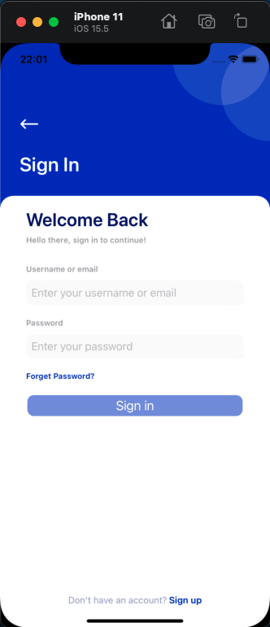
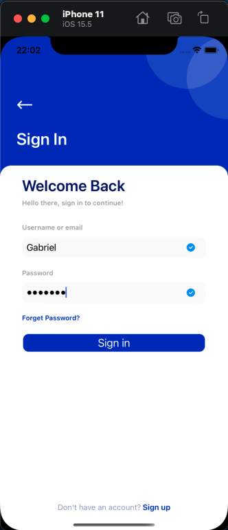

# appviewcode
Este aplicativo tem como objetivo criar um fluxo de navegação simples entre telas criadas apenas com view code. Além disso, o projeto conta com alguns compoenentes customizaveis que possuem animações.

# Design da aplicação
  
